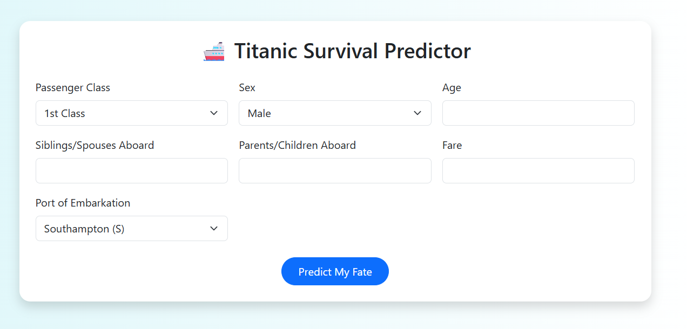
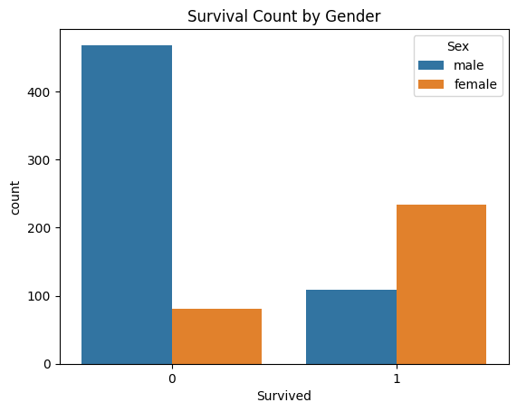
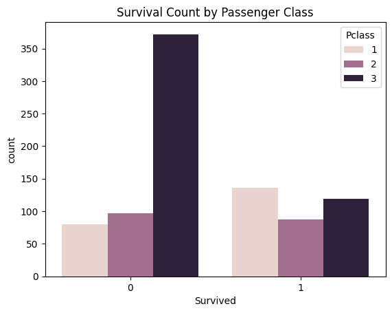
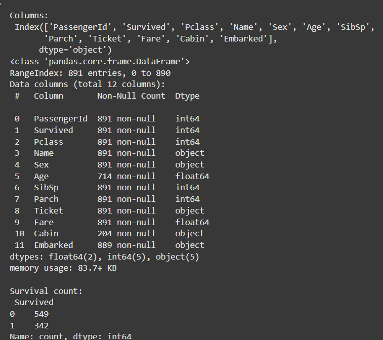
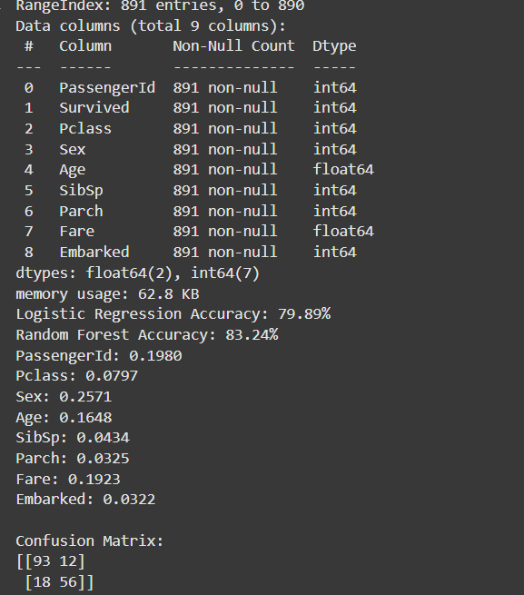
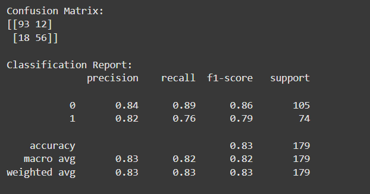

# 🚢 Titanic Survival Predictor

A modern machine learning web application that predicts the survival of Titanic passengers using user input and a trained Random Forest model. This project demonstrates a full ML workflow — from data cleaning and training to deployment using Python, Flask, HTML, and CSS.

> ⚡️ Clean. 🔬 Practical. 📈 Insightful. A great beginner-friendly end-to-end machine learning showcase.

---

## 🌟 Features

- 🎯 Accurate survival predictions with real-time input
- 🧠 Trained using a Random Forest Classifier on the Titanic dataset
- 📊 Visual EDA with graphs and tables
- 🌐 Frontend with HTML, CSS (no Streamlit!)
- 📂 Organized project structure with reusable code
- 📋 Includes classification report, confusion matrix, and model evaluation

---

## 📸 Screenshots

### 🖥 Web Interface

| UI with Inputs |
|----------------|
|  |

### 🎯 Prediction Outputs

| Survived ✅ | Did Not Survive ❌ |
|------------|-------------------|
|  |  |

### 📊 Data Analysis (Colab)

| Survival by Gender | Survival by Class |
|--------------------|-------------------|
|  |  |

### 🧾 Data Tables & Report

| Summary Table | Cleaned Data | Classification Report |
|---------------|--------------|------------------------|
|  |  |  |

---

## 🧠 Machine Learning Breakdown

- **Algorithm:** Random Forest Classifier
- **Features Used:**
  - Passenger Class (`Pclass`)
  - Sex
  - Age
  - Siblings/Spouses Aboard (`SibSp`)
  - Parents/Children Aboard (`Parch`)
  - Fare
  - Port of Embarkation (`Embarked`)
- **Preprocessing:**
  - Filled missing values
  - Encoded categorical features
  - Dropped irrelevant features (`Name`, `Ticket`, `Cabin`)
- **Evaluation:**
  - Accuracy, Confusion Matrix, Precision, Recall, F1 Score

---

## 🧪 How to Run Locally

### 1. Clone the Repository

```bash
git clone https://github.com/your-username/titanic-survival-predictor.git
cd titanic-survival-predictor
